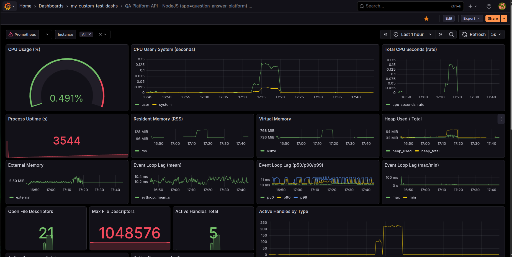
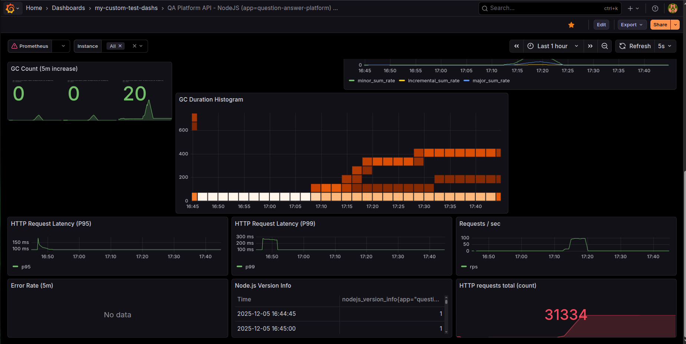

# Backend Application
Question-and-answer (Q&A) platform using NestJS, Postgres, Typeorm with Docker support and Swagger API documentation.
## 🚀 Getting Started

To run the project locally, simply use:

```bash
docker compose up
```
This will start the application along with all necessary services.
## ⚙️ Core Functionalities

- ✅ Create user
- ✅ Get all users list
- ✅ Create tag
- ✅ Get all tags list
- ✅ Create question
- ✅ Get all questions with pagination
- ✅ Answer question
- ✅ Mark an answer for a question as correct (only the owner of the question is allowed)
- ✅ Get one question with statistics about the number of answers
- ✅ Create answer
- ✅ Get statistics of answers with the number of votes
- ✅ Vote on answer
- ✅ Assign tags to questions
- ✅ Filter questions based on tags

---
## 📚 API Documentation
Swagger UI is available at:

```bash
http://localhost:3000/docs
```
You can explore all available endpoints and test them directly through the browser.


---
> **Note:** All endpoints are subject to global rate limiting unless explicitly overridden.


## 🔒 Rate Limiting

By default, the API is rate-limited to:

- **10 requests per minute per IP**
- If a user exceeds this limit, the server will respond with `429 Too Many Requests`.

---

Routes:

## Questions Routes

All endpoints are prefixed with `/questions`.

### POST `/questions`
- **Summary:** Create a new question

### GET `/questions`
- **Summary:** Get a list of questions with optional filtering by tags
- **Query Parameters:**
  - `limit` (optional): Number of questions per page
  - `page` (optional): Page number
  - `tags` (optional): Array of tags to filter questions

### GET `/questions/:id`
- **Summary:** Get a single question by ID
- **Path Parameters:**
  - `id`: UUID of the question

### GET `/questions/:id/statistics`
- **Summary:** Get statistics for a specific question
- **Path Parameters:**
  - `id`: UUID of the question

### POST `/questions/:id/make-answer`
- **Summary:** Create an answer for a specific question
- **Path Parameters:**
  - `id`: UUID of the question

### POST `/questions/:id/mark-answer-correct`
- **Summary:** Mark an answer as correct for a specific question
- **Path Parameters:**
  - `id`: UUID of the question

---

## Users Routes

All endpoints are prefixed with `/users`.

### POST `/users`
- **Summary:** Create a user (test-only functionality)

### GET `/users`
- **Summary:** Get all users (for test purposes)

---

## Tags Routes

All endpoints are prefixed with `/tags`.

### POST `/tags`
- **Summary:** Create a new tag

### GET `/tags`
- **Summary:** Get all tags with optional pagination
- **Query Parameters:**
  - `limit` (optional)
  - `page` (optional)

---

## Votes Routes

All endpoints are prefixed with `/votes`.

### POST `/votes`
- **Summary:** Submit a vote for an answer
- **Body Parameters:**
  - `answerId`
  - `voteType`
  - `userId`


---
## 🗄️ Database Info

Database Migrations:
You can find all database migration files in the following directory:


```bash
src/database/migrations
```
These migrations define the structure and changes applied to the database schema over time.


## Unit test
for running unit test, run this command:
`npm run test`

---

## 🌱 Database Seeder

The project includes a comprehensive database seeder that can generate realistic test data for development and testing purposes.

### Quick Start

```bash
# Run with small test dataset (100 users, 50 questions, etc.)
npm run seed:test

# Run with full production dataset (500k users, 50k questions, etc.)
npm run seed:production

# Run with custom configuration
npm run seed:custom
```

### Seeder Features

- **Realistic Data**: Generates meaningful questions, answers, and user profiles
- **Batch Processing**: Efficiently handles large datasets with configurable batch sizes
- **Relationship Management**: Properly seeds many-to-many relationships
- **Progress Tracking**: Real-time progress indicators during seeding
- **Multiple Configurations**: Test, production, and custom modes

### Data Volumes

**Test Mode:**
- Users: 100
- Questions: 50
- Answers: 150
- Tags: 20
- Votes: 2-5 per answer

**Production Mode:**
- Users: 500,000
- Questions: 50,000
- Answers: 150,000
- Tags: 100
- Votes: 3-10 per answer
- Question-Tags: 1-3 per question

For detailed seeder documentation, see: `src/database/seeder/README.md`

---

## 📊 Monitoring & Observability

The application includes a comprehensive monitoring stack with **Prometheus** and **Grafana** for real-time metrics, observability, and performance tracking.

### 🎯 What's Monitored

#### Application Metrics
- **HTTP Request Metrics**: Request rate, duration, status codes, and error rates
- **Database Performance**: Query execution times, connection pool stats
- **Cache Performance**: Redis hit/miss rates, operation latency
- **System Metrics**: CPU usage, memory consumption, event loop lag

#### Infrastructure Metrics
- **PostgreSQL**: Database size, active connections, transaction rates, slow queries
- **Redis**: Memory usage, command statistics, keyspace metrics
- **Node.js**: Heap usage, garbage collection, active handles

### 🚀 Quick Access

Once the application is running with `docker compose up`, access:

- **Grafana Dashboard**: [http://localhost:3001](http://localhost:3001)
  - Username: `admin`
  - Password: `admin`
- **Prometheus**: [http://localhost:9090](http://localhost:9090)
- **Application Metrics**: [http://localhost:3000/api/metrics](http://localhost:3000/api/metrics)

### 📈 Pre-configured Dashboards

The setup includes production-ready Grafana dashboards:

#### 1. Application Performance Dashboard


This dashboard provides:
- **HTTP Request Latency** (P95, P99): Track response times at different percentiles
- **Requests per Second**: Monitor traffic patterns and load
- **GC (Garbage Collection) Metrics**: 5-minute increase tracking for memory management
- **HTTP Requests Total Count**: Cumulative request statistics
- **CPU Usage**: Monitor application CPU consumption
- **Process Uptime**: Track application stability
- **Event Loop Lag**: Identify performance bottlenecks (P50/P90/P99)
- **Memory Metrics**: 
  - Resident Memory (RSS)
  - Virtual Memory
  - Heap Usage (used/total)
  - External Memory
- **File Descriptors**: Track open/max file descriptors
- **Active Handles**: Monitor active Node.js handles by type

#### 2. System & Infrastructure Dashboard


This dashboard provides:
- **CPU Usage %**: Real-time CPU utilization
- **CPU User/System Time**: Detailed CPU metrics in seconds
- **Total CPU Seconds Rate**: CPU usage trends
- **Process Uptime**: Application availability tracking
- **Resident/Virtual Memory**: Memory consumption patterns
- **Heap Memory (Used/Total)**: Node.js heap monitoring
- **External Memory**: External memory allocations
- **Event Loop Lag**: Performance metrics at different percentiles (P50/P90/P99)
- **Event Loop Lag (Max/Min)**: Event loop performance boundaries
- **Open/Max File Descriptors**: System resource utilization
- **Active Handles Total**: Connection and resource tracking
- **Active Handles by Type**: Breakdown of active handles

### 🔧 Key Features

#### Automatic Instrumentation
All HTTP requests are automatically tracked without code changes:
```typescript
// Metrics are collected automatically for all routes
GET /api/questions -> Tracked ✅
POST /api/users -> Tracked ✅
```

#### Custom Metrics Support
Easy to add custom business metrics:
```typescript
@UseInterceptors(DatabaseMetricsInterceptor)
@DatabaseOperation('find', 'questions')
async findQuestions() {
  // Database operations are automatically tracked
}
```

#### Real-time Alerting Ready
- Pre-configured with Prometheus alert rules
- Ready for integration with Alertmanager, PagerDuty, or Slack

### 📊 Metrics Available

| Metric Type | Description | Example |
|------------|-------------|---------|
| HTTP Requests | Request rate, duration, errors | `http_requests_total`, `http_request_duration_seconds` |
| Database | Query performance, connections | `database_query_duration_seconds`, `pg_stat_database_*` |
| Cache | Hit/miss rates, latency | `cache_hits_total`, `redis_memory_used_bytes` |
| System | CPU, memory, Node.js metrics | `process_cpu_usage`, `nodejs_heap_size_used_bytes` |

### 🔍 Example PromQL Queries

```promql
# HTTP Request Rate (last 5 minutes)
rate(http_requests_total[5m])

# Average Response Time
rate(http_request_duration_seconds_sum[5m]) / rate(http_request_duration_seconds_count[5m])

# Cache Hit Rate
sum(rate(cache_hits_total[5m])) / (sum(rate(cache_hits_total[5m])) + sum(rate(cache_misses_total[5m])))

# Database Query P95 Latency
histogram_quantile(0.95, rate(database_query_duration_seconds_bucket[5m]))
```

### 📚 Detailed Documentation

For comprehensive monitoring documentation, see:
- **Quick Start**: `MONITORING_SETUP.md`
- **Prometheus Module**: `src/modules/prometheus/README.md`
- **Dashboard Configurations**: `monitoring/grafana/dashboards/`

### 🎨 Dashboard Customization

All dashboards are provisioned as code and can be customized:
```bash
monitoring/grafana/dashboards/
├── application-metrics.json
├── database-metrics.json
├── cache-metrics.json
└── system-metrics.json
```

---

## Todo's for researhc:

finding node.js cpu intensive bottelneck from seeder when it wants to seed votes that takes so long

## My notes:
We need a caching strategy that will put the top cecent data into cache when starts up.
so it's going to warm up cache by it's own.

So the Stategy 1:
put top relevent questions into cache when app startsup.
